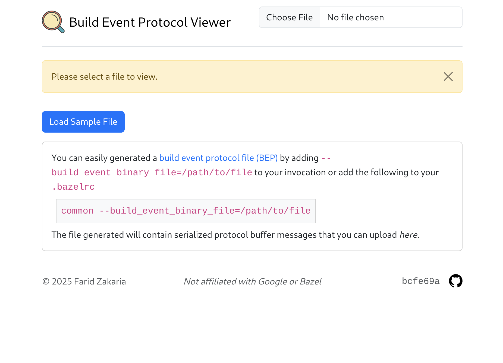
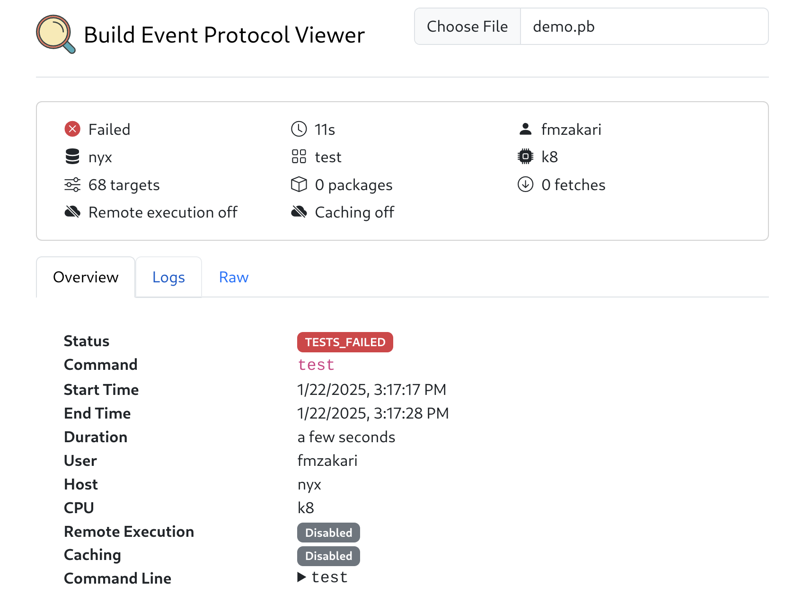

# Build Event Protocol Viewer

[https://visible.build](https://visible.build)

This project is a **front-end only** Build Event Protocol ([BEP](https://bazel.build/remote/bep-glossary)) Viewer.

It provides a user-friendly interface to visualize and analyze build events generated by [Bazel](https://bazel.build/).

### Motivation

Being a _pure_ front-end is a core tenet of this codebase. The goal is to provide as much diagnostic insight into your Bazel build without the need of a server.

I was really inspired by all the awesome other tools that are available that provide similar diagnostics with the use of a server such as: [BuildBuddy](https://www.buildbuddy.io/), [bb-portal](https://github.com/buildbarn/bb-portal), [blade](https://github.com/DolceTriade/blade) and [Bzl UI](https://github.com/stackb/bazel-stack-vscode).

## Getting Started

### Development

```sh
npm install
npm run dev
```

The application will be available at the printed port for a development server.

## Usage

1. Open your browser and navigate to `http://localhost:3000`.
2. Upload your Bazel build event binary proto file.
3. Explore and analyze the build events using the provided interface.

## Questions

1. Why is the Typescript/Javascript/Svelte so _bad_!?

I am not a frontend developer and this is my best attempt. Please contribute improvements.

2. Why not just use X (BuildBuddy, etc..) ?

I wanted a **front-end only** solution so that I can contribute it to the community and not have to manage any infrastructure. If you want more insights across invocations, I recommend those solutions.

3. Why doesn't this use Bazel to build!?

See #1. I'm happy to learn how to maket his an idiomatic Bazel build as well.

## Contributing

Contributions are welcome! Please open an issue or submit a pull request.

## License

This project is licensed under the MIT License. See the [LICENSE](LICENSE) file for details.

_This project is not affiliated with Google or Bazel._

## Screenshots



